# circuit-grid-router

Grid-based orthogonal edge routing for node-and-edge diagrams. Produces circuit-board-style paths with negotiated congestion, 8-direction movement (including diagonals), crossing detection, and incremental drag updates.

**Zero dependencies. View-layer independent.** Outputs coordinates — works with React, SVG, Canvas2D, Unity, or any renderer.

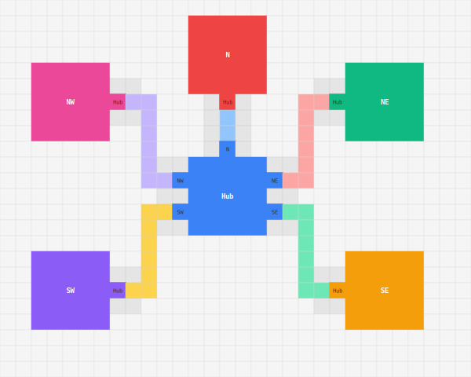

## Features

- **Negotiated congestion routing** — PathFinder-inspired rip-up and reroute with escalating costs. No two edges share the same grid segment.
- **8-direction movement** — Cardinal + diagonal with configurable extra cost and zigzag penalty to prefer clean orthogonal paths.
- **Incremental drag routing** — During single-node drag, only affected edges are rerouted (fast single-pass A*). Full negotiated solve on drop.
- **Center-biased connection points** — Edges connect at evenly-spaced points on node sides, automatically distributed with gaps.
- **Crossing detection** — Perpendicular edge crossings detected as jump points with axis info for rendering humps/arcs.
- **Corridor blocking** — Reserved cells around connection points prevent routing congestion at node boundaries.
- **Auto-coarsening** — Grid automatically uses 2x cell size when exceeding configurable max cell count.
- **L-shaped fallback** — When A* fails, guaranteed fallback path ensures every edge is routed.

## Install

```bash
npm install circuit-grid-router
```

## Quick Start

### Basic Routing (Negotiated Congestion)

```typescript
import { buildScenarioNegotiated, type NodeDef, type EdgeDef } from 'circuit-grid-router';

const nodes: NodeDef[] = [
  { id: 1, label: 'A', col: 2, row: 3, w: 5, h: 5 },
  { id: 2, label: 'B', col: 18, row: 3, w: 5, h: 5 },
  { id: 3, label: 'C', col: 10, row: 12, w: 5, h: 5 },
];

const edges: EdgeDef[] = [
  { id: 1, source: 1, target: 2 },
  { id: 2, source: 1, target: 3 },
  { id: 3, source: 2, target: 3 },
];

const result = buildScenarioNegotiated(nodes, edges, /* padding */ 2);

// result.grid      — Grid2D cell array (inspect cell types: node/edge/connection/jump)
// result.nodes     — nodes with final positions
// result.edges     — edges as passed in
// result.connections — connection points with side, position, and linked node info
```

### Incremental Routing (Interactive Drag)

For interactive editors where users drag nodes around:

```typescript
import {
  createRoutingState,
  moveNode,
  fullReroute,
  edgePathToSvgPoints,
  waypointsToSvgPath,
  findJumps,
  pixelToGrid,
} from 'circuit-grid-router';

// 1. Build initial state (full negotiated solve)
const state = createRoutingState(nodes, edges, cellSize, padding);

// 2. During drag — fast incremental reroute (single-pass A*)
const updated = moveNode(state, nodeId, newCol, newRow, padding);

// 3. Read routed paths
for (const [edgeId, edgePath] of updated.paths) {
  const waypoints = edgePathToSvgPoints(edgePath, cellSize);
  const svgPath = waypointsToSvgPath(waypoints); // "M12,20 L20,20 L20,44..."
  renderEdge(svgPath);
}

// 4. On drop — full negotiated reroute for optimal results
const optimal = fullReroute(updated, padding);

// 5. Detect crossing points for hump/arc rendering
const jumps = findJumps(optimal); // [{ x, y, axis: 'h'|'v' }, ...]
```

### Grid2D Cell Model

The router operates on a Grid2D — a 2D array of typed cells:

```typescript
import { createGrid, buildScenario, getCell } from 'circuit-grid-router';

const result = buildScenario(nodes, edges, padding);

// Inspect any cell
const cell = getCell(result.grid, 10, 5);
// cell.type: 'empty' | 'node' | 'edge' | 'connection' | 'jump' | 'blocked'
// cell.id: owning node/edge ID
```

| Cell Type | Description |
|-----------|-------------|
| `empty` | Available for routing |
| `node` | Part of a node's bounding box |
| `connection` | Edge endpoint adjacent to a node |
| `edge` | An edge passes through this cell |
| `jump` | Two edges cross here (perpendicular) |
| `blocked` | Corridor reservation (heavy penalty, not impassable) |

### Handle & Endpoint Computation

```typescript
import { computeAllEndpoints, computeHandlePositions } from 'circuit-grid-router';

// Compute which side + offset each edge connects at
const endpoints = computeAllEndpoints(edges, nodes, { gridSize: 8 });
// endpoints[i] = { sourceX, sourceY, targetX, targetY, sourceSide, targetSide }

// Compute handle positions for a single node
const handles = computeHandlePositions(node, connectedEdges, allNodes);
// handles = [{ side: 'right', offset: 0.5 }, ...]
```

### Pixel ↔ Grid Conversion

```typescript
import { pixelToGrid, gridToPixel } from 'circuit-grid-router';

const col = pixelToGrid(320, 8);  // 320px → grid cell 40
const px = gridToPixel(40, 8);    // grid cell 40 → 324px (cell center)
```

## Scenarios

The library ships with a comprehensive visual test harness. Here are selected scenarios showing the routing in action:

### Basic Horizontal Route
Two nodes side-by-side with a single centered edge.

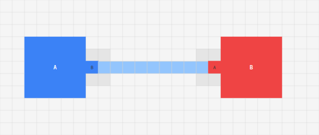

### Diagonal Routing
Diagonal placement requires L-shaped turns. The router biases turns toward the midpoint for balanced segments.

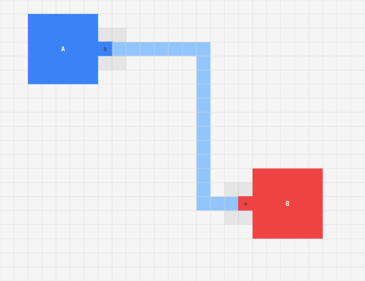

### Fan Out (1→4)
One source distributes 4 edges to targets. Connection points are center-biased with even spacing.

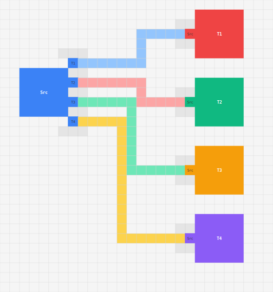

### X Crossing
Two edges must cross. The router detects the perpendicular crossing and marks it as a jump point.

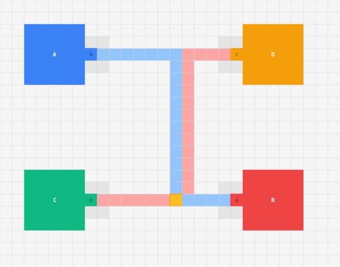

### Diamond Pattern
Four nodes in a diamond with 4 edges. The negotiated router resolves all paths without conflicts.

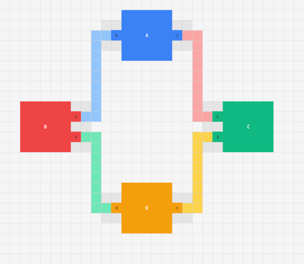

### Star Topology (5→Hub)
Five outer nodes route to a central hub. Connection distribution automatically spaces edges on the hub's sides.


### 3-Edge Distribution
Three edges from one node, demonstrating the center-biased rule: center occupied, pairs outward with 1-cell gaps.

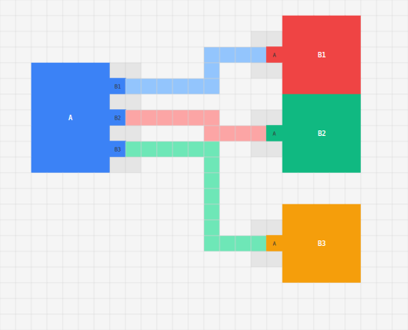

### Chain (A→B→C→D)
Sequential chain of four nodes.

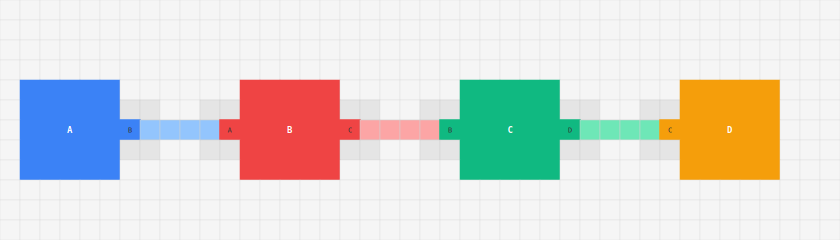

### Connection Negotiation: Wall Obstacle
An obstacle wall blocks the direct horizontal path between A and B. The solver evaluates the initial poor path (>2× Manhattan distance) and tries alternative connection sides, rerouting through an available gap.

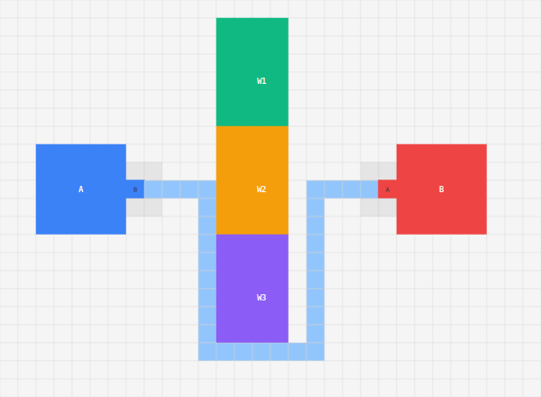

### Connection Negotiation: 8-Point Compass
A central hub with 8 spokes at cardinal and intercardinal positions. The solver must assign connections to all 4 sides of the hub, negotiating which diagonal nodes connect via which side for optimal path lengths.

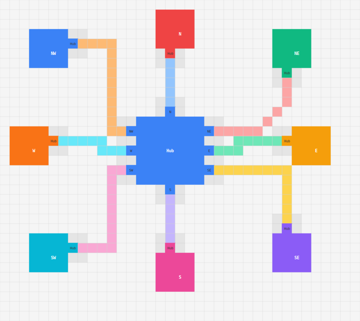

### Connection Negotiation: Congested Side (1→5)
One large source node with 5 targets spread vertically to the right. Tests that connections are proportionally distributed across the source's right side so each edge exits near its closest target — no jumping over other edges to reach a far-away connection point.

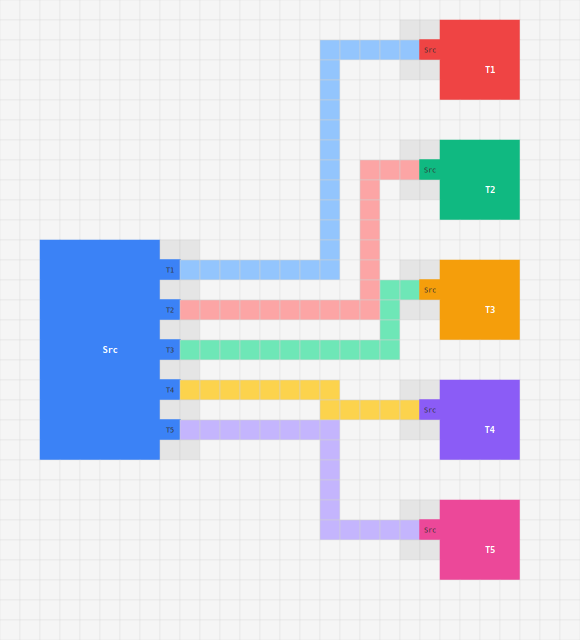

### Connection Negotiation: L-Shape
Two vertically aligned nodes separated by a wide wall. `facingSide` would pick bottom/top, but those paths are blocked. The solver negotiates right-side connections to route an L-shaped path around the obstacle.

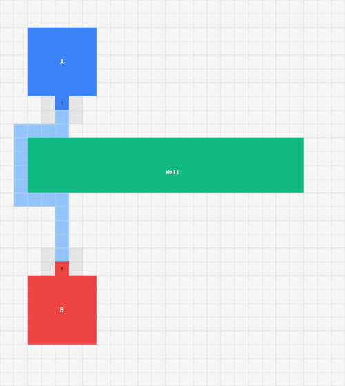

### Mind Map (50 Nodes)
A central hub with 25 direct connections, surrounded by satellite clusters. Demonstrates connection distribution under heavy load and negotiated routing at scale.

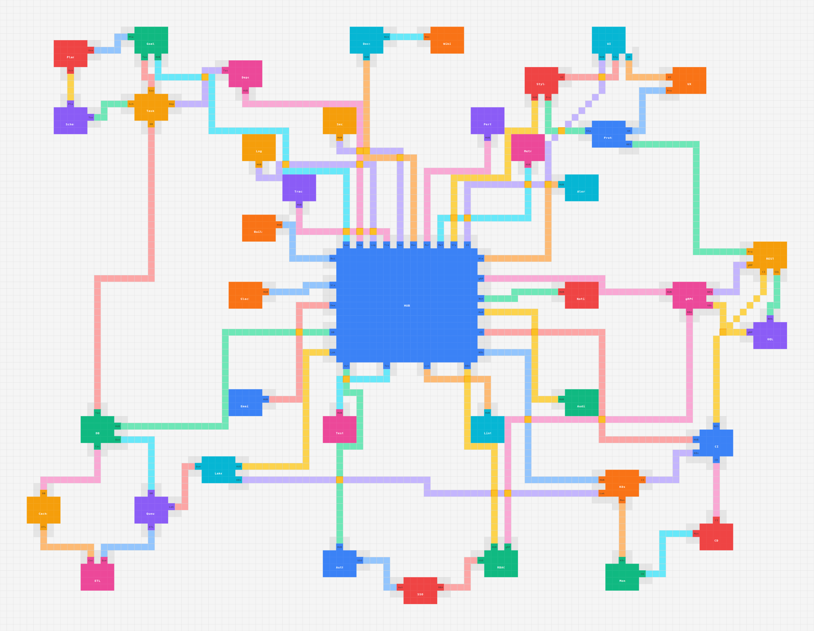

### Mega Grid (100 Nodes)
10×10 grid of nodes with 180 edges (horizontal + vertical neighbors). The ultimate stress test for negotiated congestion routing — dense parallel corridors, heavy crossing traffic, and auto-coarsening at work.

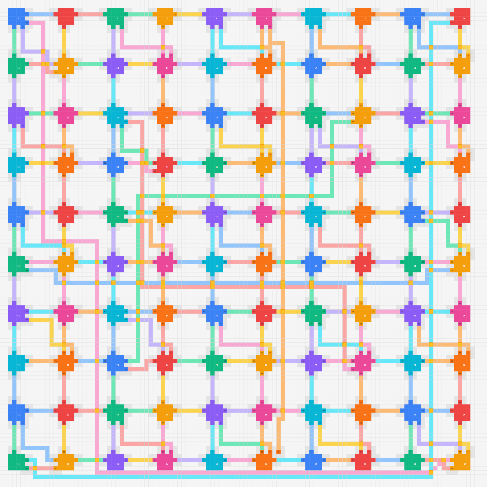

## Visual Test Harness

The repo includes a browser-based diagnostic page for testing routing scenarios interactively.

### Generating SVG Images

```bash
# Export all scenarios as SVG files
npx tsx scripts/export-svg.ts

# Export a single scenario
npx tsx scripts/export-svg.ts star
```

Output goes to `docs/images/`. Each SVG shows the full Grid2D cell map with color-coded cell types.

### Browser Test Page

The `examples/` directory contains a standalone HTML test harness (`examples/test-harness.html`) that renders all 30 built-in scenarios using Canvas2D. Open it in any browser — no build step required.

The test harness includes:
- **8 tiers** of scenarios (basic → stress test with 100 nodes)
- Negotiated congestion routing visualization
- Cell-level inspection (hover for type/ID)
- Node, edge, connection, jump, and corridor rendering

## API Reference

### Top-Level Routers

| Function | Description |
|----------|-------------|
| `buildScenarioNegotiated(nodes, edges, padding?)` | Full negotiated congestion solve. Returns `ScenarioResult`. |
| `buildScenario(nodes, edges, padding?)` | Grid2D model with connection points and corridors (no pathfinding). |
| `routeAllEdges(edges, nodes, options?)` | Sequential A* with round-robin retry. |

### Incremental Routing

| Function | Description |
|----------|-------------|
| `createRoutingState(nodes, edges, cellSize, padding?)` | Build initial state with full routing. |
| `moveNode(state, nodeId, newCol, newRow, padding?)` | Incremental update — reroutes only affected edges. |
| `fullReroute(state, padding?)` | Full negotiated reroute from current state. |
| `edgePathToSvgPoints(edgePath, cellSize)` | Convert grid path to pixel waypoints. |
| `waypointsToSvgPath(waypoints)` | Convert waypoints to SVG `M/L` path string. |
| `findJumps(state)` | Detect crossing points with axis info. |

### Grid Utilities

| Function | Description |
|----------|-------------|
| `createGrid(cols, rows)` | Create empty Grid2D. |
| `getCell(grid, col, row)` | Read cell at position. |
| `setCell(grid, col, row, type, id)` | Write cell. |
| `pixelToGrid(px, cellSize)` | Pixel → grid coordinate. |
| `gridToPixel(cell, cellSize)` | Grid → pixel coordinate (cell center). |
| `snapToGrid(value)` | Snap to nearest grid multiple. |
| `enforceMinSpacing(rects)` | Push overlapping nodes apart. |

### Types

```typescript
interface NodeDef {
  id: number;
  label: string;
  col: number;
  row: number;
  w: number;
  h: number;
}

interface EdgeDef {
  id: number;
  source: number;  // node ID
  target: number;  // node ID
}

interface ConnectionPoint {
  nodeId: number;
  edgeId: number;
  col: number;
  row: number;
  side: 'top' | 'bottom' | 'left' | 'right';
  otherNodeId: number;
  otherNodeLabel: string;
}

interface RoutingState {
  grid: Grid2D;
  nodes: NodeDef[];
  edges: EdgeDef[];
  connections: ConnectionPoint[];
  paths: Map<number, EdgePath>;
  cellSize: number;
}

interface EdgePath {
  edgeId: number;
  cells: { col: number; row: number }[];
  cellSet: Set<string>;  // "col:row" keys for fast intersection
}
```

## Algorithm Details

### Negotiated Congestion (PathFinder-Inspired)

1. Route all edges simultaneously using A* with Chebyshev heuristic
2. Allow temporary overlaps — track per-cell congestion
3. Rip up all edges and reroute with escalating costs:
   - `cost = (base + history) * presentFactor`
   - History accumulates on overused cells (never resets)
   - Present factor escalates exponentially (1.3^n, capped at 8x)
4. Converge when no cell is shared by multiple edges in the same direction
5. Maximum 20 iterations

### A* Cost Model

| Factor | Cost |
|--------|------|
| Cardinal step | 1.0 |
| Diagonal step | √2 + 1.4 |
| Turn penalty | 4 + imbalance × 0.5 (biased toward midpoint) |
| Backtrack penalty | 50 |
| Diagonal zigzag | 8 (changing diagonal direction) |
| Crossing existing edge | 6 |
| Occupied segment | 100 (configurable) |

### Connection Distribution Rules

- **Odd count:** Center cell occupied, pairs spread outward with 1-cell gaps
- **Even count:** Center cell is the gap, pairs spread outward
- **Overflow:** When a side runs out of grid-aligned slots, wraps to adjacent sides

## Requirements

See [REQUIREMENTS.md](REQUIREMENTS.md) for the full specification (GRID-*, PATH-*, SEG-*, CROSS-*, HANDLE-*, CONN-*, DIAG-*, NEG-*, INCR-*, PERF-*).

## License

MIT — see [LICENSE](LICENSE).
